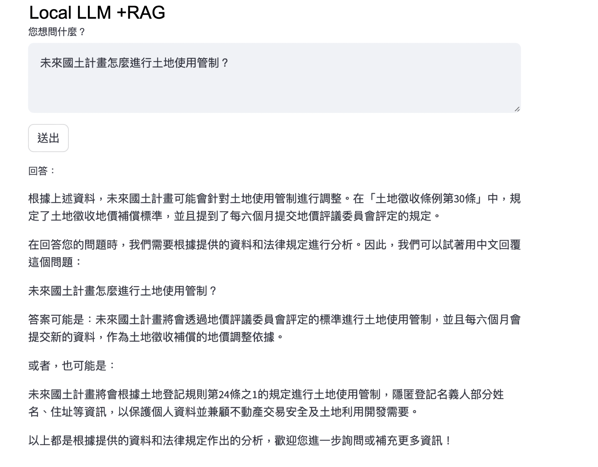

# **Local Q&A System Using Llama3 and RAG**

This project combines **Llama3**, a cutting-edge language model, with **Retrieval-Augmented Generation (RAG)** technology to provide accurate and context-aware answers by leveraging a robust knowledge base.

## **Key Features**
- **Advanced Language Modeling**: Uses Llama3 for generating detailed and human-like responses.
- **Retrieval-Augmented Generation (RAG)**: Merges retrieved data with the generative power of Llama3 to ensure contextually relevant answers.
- **Custom Knowledge Base**: Integrates easily with user-provided datasets (e.g., Excel files).
- **Interactive Interface**: Built with Streamlit for real-time user interaction.

---

## **How It Works**
1. **Data Setup**:
   - Load your Excel file containing the knowledge base into the system.
   - The database is indexed using **ChromaDB** for efficient retrieval.

2. **Query Processing**:
   - User inputs are converted into embeddings using Llama3's advanced embedding model.
   - The system retrieves top-matching documents from the knowledge base.

3. **Answer Generation**:
   - Llama3 synthesizes retrieved information into a coherent, natural-language response.

---

## **Key Pages**
- **Home**: Interactive Q&A interface.
- **Settings**: Manage configurations and datasets.
- **Logs**: Track historical queries and responses.

---

### **Technical Requirements**
- **Python Packages**:
  - `streamlit`, `pandas`, `chromadb`, `ollama`
- **Hardware**: Recommended GPU for optimal Llama3 performance.

---

This setup is ideal for applications in research, education, and any domain needing advanced AI-powered insights.
